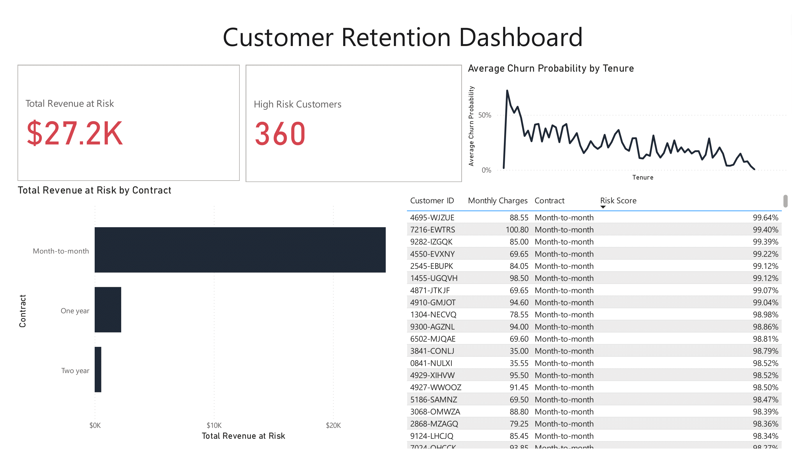

# Telco Customer Churn Prediction & Dashboard

## Project Overview
**The Goal:** Prevent customer churn by identifying at-risk customers early.  
**The Insight:** Month-to-month contracts and Fiber Optic internet are the primary drivers of churn.  
**The Impact:** Identified **$27,200** in monthly revenue at risk (Monthly Recurring Revenue).

## The Dashboard

*Built in Power BI to visualize high-risk segments.*

## Technologies Used
*   **Python:** Pandas, NumPy, Scikit-Learn.  
*   **Machine Learning:** XGBoost Classifier.  
*   **Imbalance Handling:** SMOTE (Synthetic Minority Over-sampling Technique).  
*   **Explainability:** SHAP (SHapley Additive exPlanations).  
*   **Visualization:** Power BI.

## Key Technical Steps
1.  **Data Cleaning:** Handled missing values in `TotalCharges` and performed One-Hot Encoding.  
2.  **Class Imbalance:** Applied **SMOTE** to the training set to address the heavy skew towards "No Churn."  
3.  **Modeling:** Trained an **XGBoost** model achieving **78.6% Accuracy**.  
4.  **Feature Importance:** Used SHAP values to explain *why* the model predicts churn (Contract Type & Tenure were top factors).

## Results & Business Value
*   **Total Revenue at Risk:** $27.2K isolated.  
*   **High Risk Volume:** 360 Customers identified with >50% probability of leaving.  
*   **Action Plan:** Generated a prioritized "Call List" for the support team to intervene with high-value customers immediately.

## Files Included
*   `churn_analysis.ipynb`: The complete Python code for EDA, Preprocessing, and Modeling.  
*   `churn_dashboard.pbix`: The interactive Power BI dashboard file.  
*   `dataset.csv`: The source data (IBM Telco Dataset).
